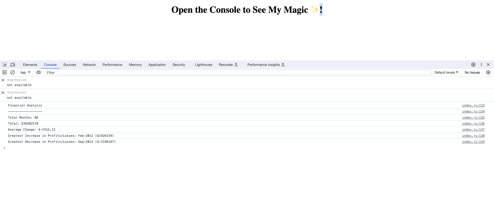

# Welcome to the Module 4 Challenge
## Console-Finances

# Description

 ### This JavaScript code is designed to help to analyze a financial dataset. 
 
* Below are the key financial metrics it calculates:

## Total Months:

• This tells you how many months are included in the dataset.

• Understanding of the total profit or loss over the entire period.

• Understand the average change in profit or loss from month to month.

• Identify the month with the highest increase in profits or the smallest decrease in losses.

 ### Spot the month with the largest decrease in profits or the smallest increase in losses.

- Net Total Amount of Profit/Losses:
- Average of Changes in Profit/Losses:
- Greatest Increase in Profit/Losses:
- Greatest Decrease in Profit/Losses:

## Github Page:
Use the [link](https://github.com/SamiraBalayoglu/Console-FInances) to access the page on Github. 

## Home Page Screenshot:

## Thanks for your time and consideration. 